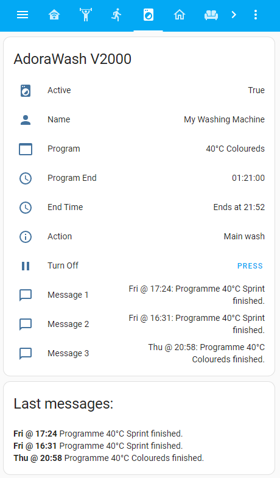

[](https://github.com/hacs/integration)


# V-Zug Integration for Home Assistant

This component will allow you to see the status of your V-Zug AdoraWash V2000. The only remove interaction allowed by the V-Zug API is to pause a running program. It then needs to be restarted at the washing machine.

This component might also work to a certain extend with other V-Zug devices.

## Features

### Sensors:
- **Active**: (TODO Binary): Shows, if appliance is currently active
- **Action**:
- **End Time**:
- **Name**:
- **Messages Text**:
- **Message 1 Text**:
- **Message 2 Text**:
- **Message 3 Text**:
- **Name**:
- **Program**:
- **Program End**:

### Front End:



#### Good to know:

The sensor "sensor.adorawash_v2000_***messages***" is preformatted for a Markdown card. Look for the ..._messages sensor.
To use it, use a card of type markdown with the following code:

``` YAML
- type: markdown
  content: '{{states.sensor.adorawash_v2000_messages.state}}'
  title: 'Last messages:'

```

Here is a complete snipnet of my complete front end page:

``` YAML
- theme: Backend-selected
  title: Wash
  path: wash
  icon: mdi:washing-machine
  badges: []
  cards:
    - type: entities
      entities:
        - entity: binary_sensor.adorawash_v2000_active
          name: Active
        - entity: sensor.adorawash_v2000_name
          name: Name
        - entity: sensor.adorawash_v2000_program
          name: Program
        - entity: sensor.adorawash_v2000_program_end
          name: Program End
        - entity: sensor.adorawash_v2000_end_time
          name: End Time
        - entity: sensor.adorawash_v2000_status_action
          name: Action
        - entity: button.adorawash_v2000_turn_off
          name: Turn Off
        - entity: sensor.adorawash_v2000_message_1
          name: Message 1
        - entity: sensor.adorawash_v2000_message_2
          name: Message 2
        - entity: sensor.adorawash_v2000_message_3
          name: Message 3
      title: AdoraWash V2000
    - type: markdown
      content: '{{states.sensor.adorawash_v2000_messages.state}}'
      title: 'Last messages:'
```


## Usage

Lovelace example: TODO


## Installation
### Option 1 (Recommended)

Use HACS. This ensures, you receive notifications about newer versions.

### Option 2

1. Using the tool of choice open the directory (folder) for your HA configuration (where you find `configuration.yaml`).
2. If you do not have a `custom_components` directory (folder) there, you need to create it.
3. In the `custom_components` directory (folder) create a new folder called `integration_blueprint`.
4. Download _all_ the files from the `custom_components/integration_blueprint/` directory (folder) in this repository.
5. Place the files you downloaded in the new directory (folder) you created.
6. Restart Home Assistant
7. In the HA UI go to "Configuration" -> "Integrations" click "+" and search for "Integration blueprint"

Using your HA configuration directory (folder) as a starting point you should now also something similar to this (Note: _Not all actual files are listed here_):

```text
custom_components/v_zug/translations/en.json
custom_components/v_zug/__init__.py
custom_components/v_zug/api.py
custom_components/v_zug/binary_sensor.py
custom_components/v_zug/button.py
custom_components/v_zug/config_flow.py
custom_components/v_zug/const.py
custom_components/v_zug/manifest.json
custom_components/v_zug/sensor.py
```

## Configuration is done in the UI

You need to enter the IP address of your V-Zug appliance. Typically, you would log into your router and look under connected devices. Once you found it, make sure you assign it as a static IP address. Otherwise, it might change at some point and break the link to the integration.


<!---->

## Contributions are welcome!

If you want to contribute to this please read the [Contribution guidelines](CONTRIBUTING.md)

![license-shield]

***

[integration_blueprint]: https://github.com/custom-components/integration_blueprint
[buymecoffee]: https://www.buymeacoffee.com/ludeeus
[buymecoffeebadge]: https://img.shields.io/badge/buy%20me%20a%20coffee-donate-yellow.svg?style=for-the-badge
[commits-shield]: https://img.shields.io/github/commit-activity/y/custom-components/blueprint.svg?style=for-the-badge
[commits]: https://github.com/magicmatt007/v_zug/commits/master
[hacs]: https://github.com/custom-components/hacs
[hacsbadge]: https://img.shields.io/badge/HACS-Custom-orange.svg?style=for-the-badge
[discord]: https://discord.gg/Qa5fW2R
[discord-shield]: https://img.shields.io/discord/330944238910963714.svg?style=for-the-badge
[exampleimg]: example.png
[forum-shield]: https://img.shields.io/badge/community-forum-brightgreen.svg?style=for-the-badge
[forum]: https://community.home-assistant.io/
[license-shield]: https://img.shields.io/github/license/custom-components/blueprint.svg?style=for-the-badge
[maintenance-shield]: https://img.shields.io/badge/maintainer-Joakim%20Sørensen%20%40ludeeus-blue.svg?style=for-the-badge
[releases-shield]: https://img.shields.io/github/release/custom-components/blueprint.svg?style=for-the-badge
[releases]: https://github.com/custom-components/integration_blueprint/releases
